# Brew O'Clock — Responsive Product Landing Page

## MP04 – Responsive Product Landing Page

Brew O'Clock is a responsive café landing page that I developed using **Laravel, Blade Components, Tailwind CSS, and JavaScript**.

This project was created for our **ITST 302 – Client-Server Technologies Week 5 Laboratory Activity**. The main goal of the activity was to build a responsive landing page for a real business while practicing reusable Blade Components, Tailwind CSS, responsive layouts, and proper frontend organization.

For this project, I chose **Brew O'Clock**, a café that offers drinks, desserts, and a comfortable space where customers can relax, study, work, or spend time with friends.

---

# Introduction

A landing page is usually one of the first things customers see when they visit a business online. Because of that, it needs to clearly communicate what the business offers while also being easy to use on different devices.

For Brew O'Clock, I wanted the website to feel warm, simple, and welcoming instead of looking like a generic business template.

The landing page highlights the café's products, features, customer feedback, location, and opening hours. I also added a simple ordering process so users can interact with the products instead of only viewing them.

---

# Objectives

While developing this project, I focused on the following objectives:

- Build a responsive landing page using Laravel.
- Use Tailwind CSS for the overall design.
- Practice mobile-first responsive design.
- Create reusable Laravel Blade Components.
- Reduce repeated code by using components.
- Practice Flexbox and CSS Grid.
- Create a consistent color palette and typography.
- Make the website usable on desktop, tablet, and mobile.
- Add a simple frontend ordering process.
- Practice JavaScript DOM manipulation and localStorage.
- Organize the frontend files properly.
- Document the project through GitHub.

---

# About Brew O'Clock

Brew O'Clock is a neighborhood café made for people who enjoy coffee, desserts, quiet work sessions, and casual conversations.

Instead of making the website feel too corporate, I used a warm café-inspired design with cream, brown, and orange tones.

Some of the featured products on the website include:

- Matcha
- Biscoff Cake
- Blueberry Cheesecake
- Red Velvet Cake

The actual product images are stored inside:

```text
public/images/
```

---

# Main Features

## Responsive Navigation

The website includes a responsive navigation bar with links to:

- Home
- Features
- Menu
- Testimonials
- Contact
- Sign In
- Order Now

On smaller screens, the navigation changes into a mobile menu.

---

## Hero Section

The hero section introduces the business and gives users a quick idea of what Brew O'Clock offers.

It includes:

- Café opening hours
- Main headline
- Short description
- Call-to-action buttons
- Product images
- Quick café highlights

---

## Features Section

The landing page presents six main café features:

1. Reliable Wi-Fi
2. Affordable Favorites
3. Comfortable Space
4. Quiet Corners
5. Freshly Prepared Products
6. Open Daily

I used reusable Blade Components for the feature cards so I did not have to repeat the same structure for every item.

---

## Menu and Product Section

The menu section displays the café products together with their name, image, price, category, and an **Add to Order** button.

Products are displayed using a reusable `product-card.blade.php` component.

Example:

```blade
<x-product-card
    id="matcha"
    name="Matcha"
    price="120"
    category="Drink"
    image="images/matcha.png"
/>
```

This makes it easier to add more products without rewriting the entire card design.

---

# Ordering Process

Aside from the landing page itself, I also added a simple frontend ordering flow.

The process works like this:

```text
Browse Menu
    ↓
Add Product to Order
    ↓
Open Cart
    ↓
Change Quantity or Remove Product
    ↓
Proceed to Checkout
    ↓
Enter Customer Information
    ↓
Choose Pickup or Dine-in
    ↓
Place Order
    ↓
Order Confirmation
```

The customer can:

- Add products to the cart
- Increase item quantity
- Decrease item quantity
- Remove products
- View the subtotal
- Enter customer information
- Choose between Pickup and Dine-in
- Add optional notes
- Submit the order
- Receive a generated order number

The cart uses browser `localStorage`, so selected products can remain in the cart even after refreshing the page.

This is currently a **frontend demonstration only**. There is no real database, payment gateway, or order-processing backend connected yet.

---

# Sign In Page

I also created a responsive sign-in page to match the navigation requirement of the landing page.

The page includes:

- Email field
- Password field
- Show / hide password
- Remember Me option
- Forgot Password interface
- Sign In button
- Continue as Guest option

The current sign-in form is only for frontend demonstration and does not yet use Laravel authentication or a database.

---

# Responsive Web Design

One of the main goals of the activity was making sure the website works properly on different screen sizes.

I tested the website on:

- Desktop
- Laptop
- Tablet
- Mobile phone

## Mobile-First Design

I used Tailwind CSS responsive classes so the layout automatically changes depending on the available screen width.

For example:

```html
<div class="grid gap-6 sm:grid-cols-2 lg:grid-cols-4">
```

This means the layout behaves like this:

```text
Mobile  → 1 column
Tablet  → 2 columns
Desktop → 4 columns
```

This approach helped keep the website readable even when the screen becomes smaller.

---

## Responsive Breakpoints

Some of the Tailwind breakpoints I used are:

```text
sm:
md:
lg:
xl:
```

Examples from the project:

```html
hidden lg:flex
```

```html
sm:grid-cols-2
```

```html
lg:grid-cols-4
```

```html
lg:px-8
```

---

## Flexbox

I used Flexbox for sections such as:

- Navigation bar
- Buttons
- Cart controls
- Product information
- Call-to-action sections
- Footer content

Example:

```html
<div class="flex items-center justify-between">
```

---

## CSS Grid

CSS Grid is used for:

- Product cards
- Feature cards
- Testimonials
- Product showcase
- Sign-in layout

Example:

```html
<div class="grid gap-5 sm:grid-cols-2 lg:grid-cols-3">
```

---

# Tailwind CSS

I used **Tailwind CSS** for the styling of the project.

Instead of creating a large custom CSS file, most styles are written directly using Tailwind utility classes.

Example:

```html
<button
    class="rounded-full bg-[#bf6539] px-6 py-3 text-sm font-semibold text-white"
>
    Order Now
</button>
```

Some of the Tailwind features I used include:

- Responsive breakpoints
- Flexbox
- Grid
- Padding and margin utilities
- Background colors
- Text colors
- Rounded corners
- Borders
- Shadows
- Hover effects
- Transitions

Using Tailwind made it easier for me to keep the spacing and design consistent throughout the website.

---

# Blade Components

One of the main things I practiced in this activity was using reusable **Laravel Blade Components**.

Instead of repeating the same HTML structure, I separated reusable parts of the interface into their own files.

The components currently used in the project are:

```text
resources/views/components/
├── button.blade.php
├── cart-drawer.blade.php
├── checkout-modal.blade.php
├── feature-card.blade.php
├── footer.blade.php
├── hero.blade.php
├── navbar.blade.php
├── order-confirmation.blade.php
├── pricing-card.blade.php
├── product-card.blade.php
└── testimonial-card.blade.php
```

This helped make the code cleaner and easier to maintain.

For example, instead of writing the same product card four times, I can reuse:

```blade
<x-product-card
    id="blueberry"
    name="Blueberry Cheesecake"
    price="135"
    category="Cheesecake"
    image="images/blueberry.png"
/>
```

The same idea is used for features, testimonials, buttons, and other parts of the interface.

---

# User Interface Design

## Color Palette

I wanted the website to feel warm and suitable for a café, so I used mostly cream, brown, and orange shades.

| Purpose | Color |
| --- | --- |
| Main Background | `#F8F0E3` |
| Secondary Background | `#F1E4D0` |
| Dark Brown | `#2B1D16` |
| Main Accent | `#BF6539` |
| Muted Text | `#746254` |
| Card Background | `#FBF5EB` |

The orange accent is mainly used for buttons, prices, labels, and other important actions.

---

## Typography

The project uses two fonts.

### Playfair Display

I used Playfair Display for:

- Main headings
- Product names
- Section titles
- Brand-related text

### DM Sans

I used DM Sans for:

- Body text
- Buttons
- Navigation
- Forms
- Product details

Using two different fonts helped give the website a café-like personality while keeping the content easy to read.

---

## Buttons

Most buttons use a rounded pill style.

Primary buttons use the Brew O'Clock orange color, while secondary actions use outlines or dark colors.

Hover effects were also added to give users visual feedback when interacting with buttons.

---

## Cards

Product cards, feature cards, and testimonial cards use:

- Rounded corners
- Soft background colors
- Light borders
- Minimal shadows
- Consistent spacing
- Small hover animations

I tried to avoid using too many heavy shadows so the website would still feel clean and simple.

---

# Project Structure

```text
mp04-responsive-product-landing-page/
│
├── app/
│
├── public/
│   └── images/
│       ├── logo.png
│       ├── matcha.png
│       ├── biscoff cake.png
│       ├── blueberry.png
│       └── red velvet.png
│
├── resources/
│   │
│   ├── css/
│   │   └── app.css
│   │
│   ├── js/
│   │   └── app.js
│   │
│   └── views/
│       │
│       ├── layouts/
│       │   └── app.blade.php
│       │
│       ├── components/
│       │   ├── button.blade.php
│       │   ├── cart-drawer.blade.php
│       │   ├── checkout-modal.blade.php
│       │   ├── feature-card.blade.php
│       │   ├── footer.blade.php
│       │   ├── hero.blade.php
│       │   ├── navbar.blade.php
│       │   ├── order-confirmation.blade.php
│       │   ├── pricing-card.blade.php
│       │   ├── product-card.blade.php
│       │   └── testimonial-card.blade.php
│       │
│       └── pages/
│           ├── home.blade.php
│           └── sign-in.blade.php
│
├── routes/
│   └── web.php
│
├── screenshots/
│
├── documentation/
│
└── README.md
```

---

# Folder Explanation

## `resources/views/layouts`

This folder contains the main Blade layout of the website.

The `app.blade.php` file contains the common page structure used by the other pages.

---

## `resources/views/components`

This folder contains reusable interface elements such as:

- Navbar
- Hero
- Buttons
- Product cards
- Feature cards
- Cart
- Checkout
- Testimonials
- Footer

---

## `resources/views/pages`

This folder contains the main pages of the website.

Currently:

```text
home.blade.php
sign-in.blade.php
```

---

## `public/images`

This folder contains the Brew O'Clock logo and product images.

---

## `resources/js`

This folder contains the JavaScript used for:

- Mobile navigation
- Shopping cart
- Product quantity controls
- localStorage
- Checkout
- Order confirmation
- Sign-in interactions

---

## `screenshots`

This folder contains screenshots of the finished project.

---

## `documentation`

This folder contains the before-and-after screenshots showing how the design changed during development.

---

# Screenshots

## Desktop View

The desktop version shows the complete layout of the landing page on a larger screen.

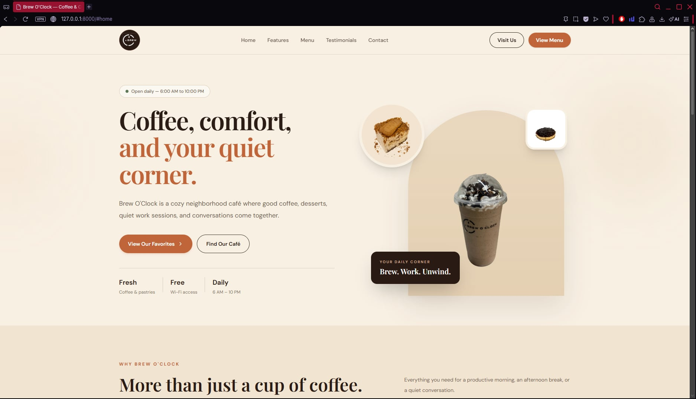

---

## Tablet View

The tablet layout shows how the website adjusts when there is less horizontal space.

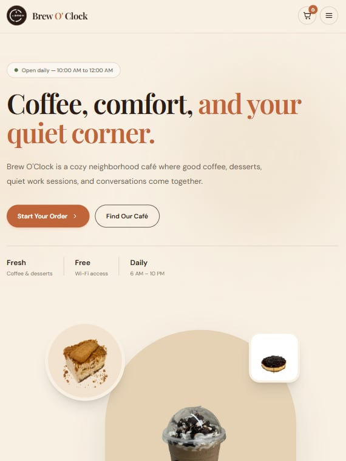

---

## Mobile View

The mobile layout uses stacked sections, responsive product cards, and a mobile navigation menu.

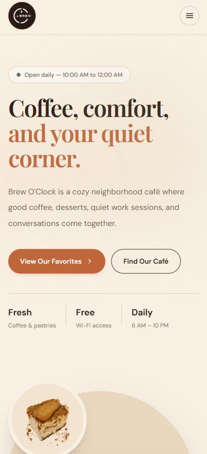

---

## Navigation Bar

The navigation bar provides quick access to the major sections of the website.

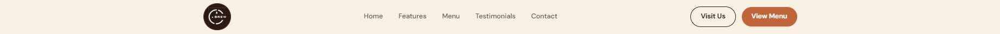

---

## Hero Section

The hero introduces Brew O'Clock and highlights the main call-to-action.

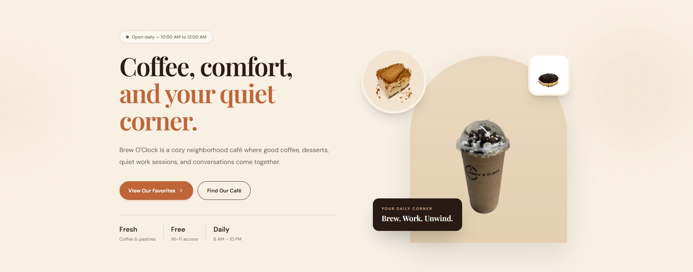

---

## Features Section

The features section presents some of the main reasons customers may want to visit the café.

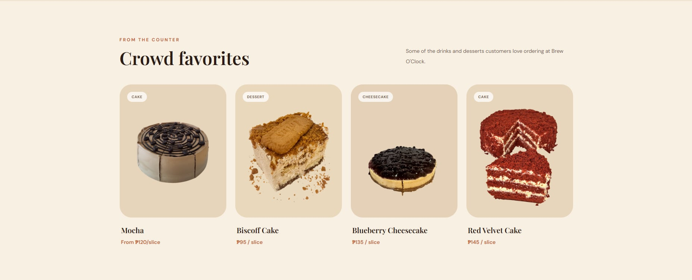

---

## Pricing / Product Section

This section displays the product prices and menu choices.

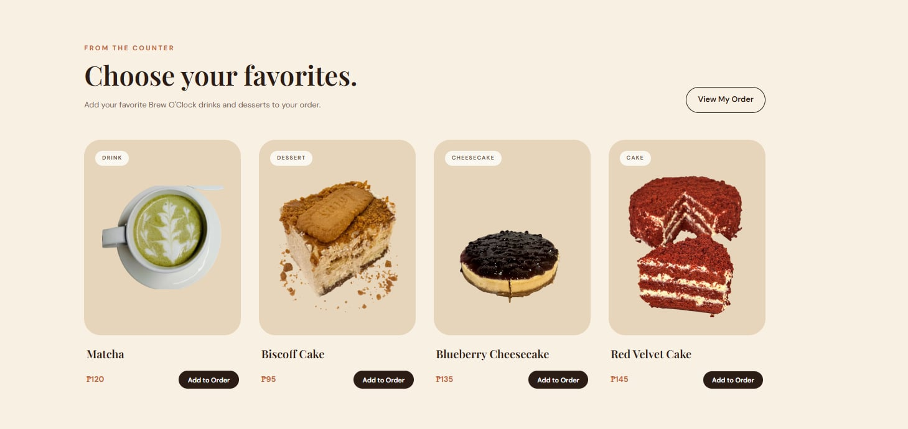

---

## Testimonials

The testimonial section displays sample feedback from regular customers.

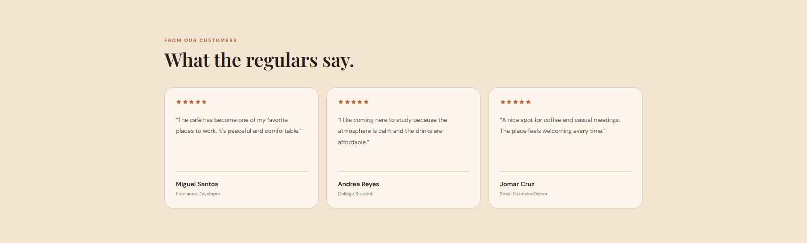

---

## Footer

The footer contains quick links, the business location, and opening hours.

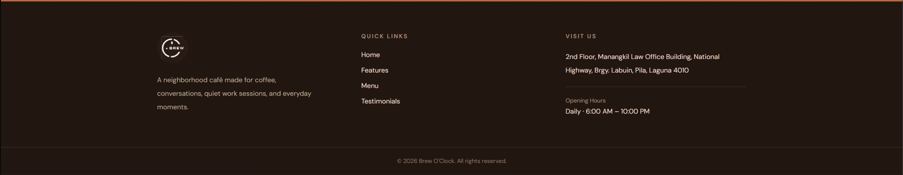

---

# Additional Features

## Sign In Page

A responsive sign-in interface was added to provide a clearer customer flow.

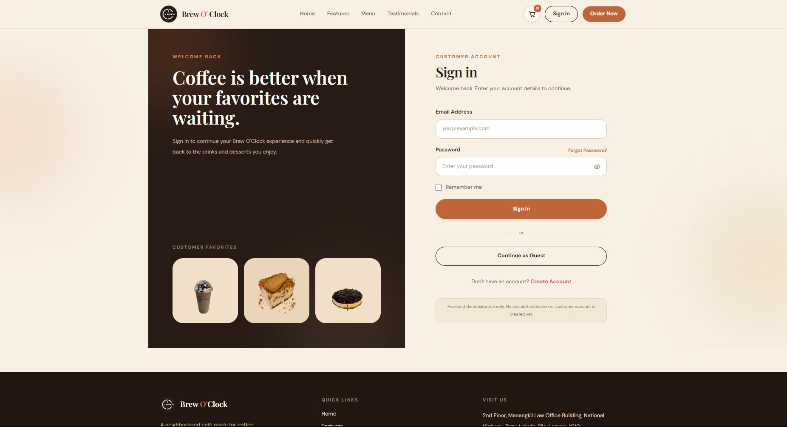

---

## Shopping Cart

The cart allows customers to review the items they added to their order.

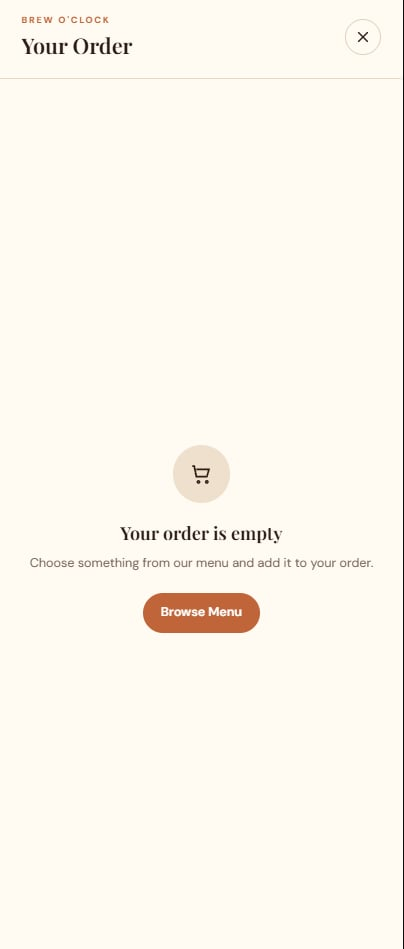

---

## Checkout

The checkout interface collects basic customer and order information.

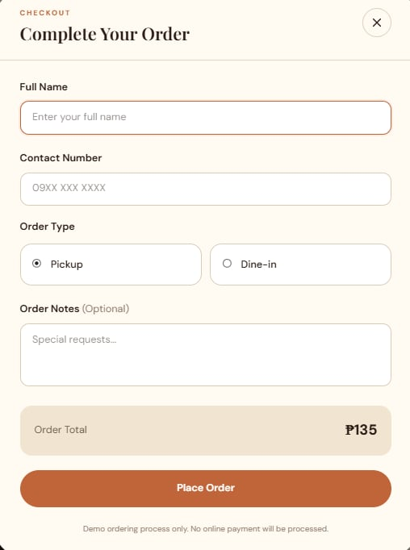

---

## Order Process

The ordering process demonstrates how customers can move from choosing a product to completing an order.

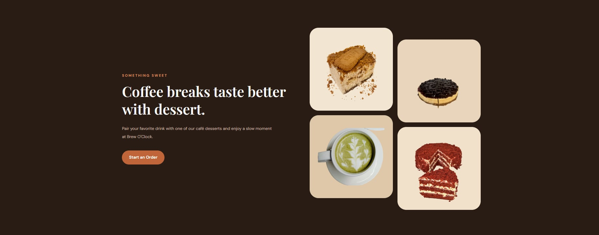

---

# Project Organization

## Blade Components

This screenshot shows the reusable Blade Components used throughout the project.

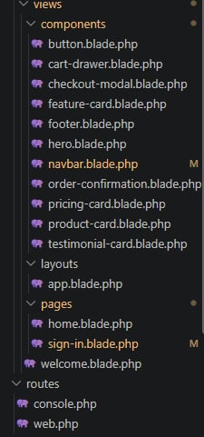

---

## Project Structure

The project was organized using separate folders for layouts, components, pages, JavaScript, styles, screenshots, and documentation.

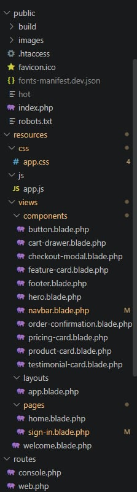

---

# Before and After Comparison

One of the useful parts of this activity was comparing the first version of the interface with the final version.

## Before

The first version already had the basic idea of the landing page, but the layout was still simple and several areas felt empty.

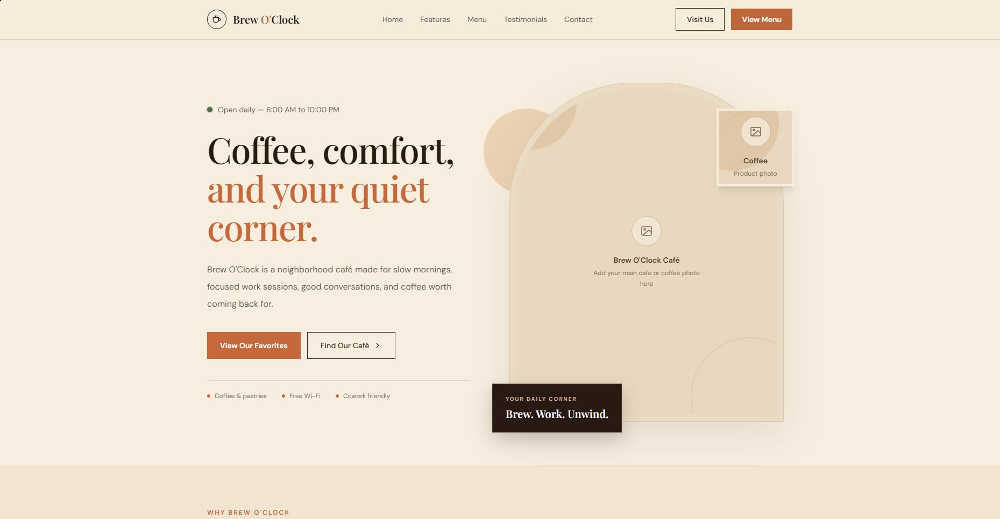

## After

In the final version, I improved the spacing, typography, colors, responsive behavior, product presentation, navigation, and overall visual hierarchy.

I also added additional functionality such as the cart, checkout process, order confirmation, and sign-in interface.

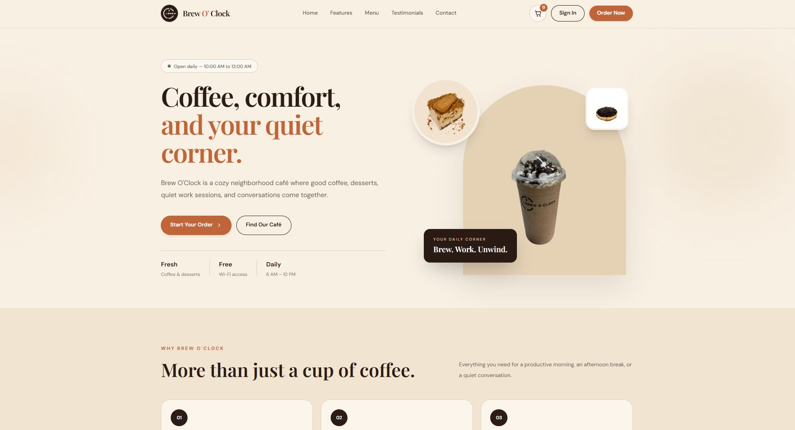

---

# Problems I Encountered

## Vite Bootstrap Import Error

One issue I encountered happened when `app.js` tried to import a `bootstrap.js` file that did not exist.

The error was:

```text
Failed to resolve import "./bootstrap"
```

I fixed this by removing the unnecessary import because this project did not need the default Laravel JavaScript bootstrap file.

---

## Responsive Navigation

The full desktop navigation did not fit properly on smaller screens.

To solve this, I created a separate mobile navigation menu and used Tailwind breakpoints such as:

```html
hidden lg:flex
```

and:

```html
lg:hidden
```

---

## Repeated Product Code

At first, product cards could easily become repetitive.

I solved this by creating:

```text
product-card.blade.php
```

Now I can display another product by changing only its component properties.

---

## Keeping Cart Items After Refresh

Another problem was that cart items would disappear when the browser refreshed.

I solved this by using:

```javascript
localStorage
```

The cart data can now remain available after a refresh.

---

# Technologies Used

| Technology | Purpose |
| --- | --- |
| Laravel | Main web framework |
| Blade | Laravel templating |
| Blade Components | Reusable UI components |
| Tailwind CSS | Responsive styling |
| JavaScript | Frontend interactions |
| LocalStorage | Temporary cart storage |
| Vite | Frontend asset bundling |
| Git | Version control |
| GitHub | Repository hosting and documentation |

---

# Installation

To run the project locally:

## 1. Clone the repository

```bash
git clone https://github.com/johncarlobenitez/MP04-Responsive-Product-Landing-Page.git
```

## 2. Open the project

```bash
cd mp04-responsive-product-landing-page
```

## 3. Install Laravel dependencies

```bash
composer install
```

## 4. Create the `.env` file

Windows:

```bash
copy .env.example .env
```

## 5. Generate the Laravel application key

```bash
php artisan key:generate
```

## 6. Install frontend dependencies

```bash
npm install
```

## 7. Start Vite

```bash
npm run dev
```

## 8. Start Laravel

Open another terminal:

```bash
php artisan serve
```

Then open:

```text
http://127.0.0.1:8000
```

---

# Responsive Testing

I tested the website using browser developer tools.

Some of the viewport sizes I used were:

```text
Mobile
375 × 667
390 × 844

Tablet
768 × 1024

Desktop
1366 × 768
1920 × 1080
```

I checked:

- Navigation
- Product cards
- Hero section
- Text readability
- Cart drawer
- Checkout modal
- Sign-in page
- Footer
- Image scaling

---

# What I Learned

This project helped me understand that responsive design is more than simply shrinking a desktop website.

Some layouts need to stack differently, buttons need enough space to be tapped easily, and text needs to stay readable even on a small screen.

I also learned how useful Blade Components are for keeping a Laravel frontend organized. Instead of repeating the same structures multiple times, I was able to reuse components for products, features, testimonials, buttons, and other parts of the interface.

The ordering process also gave me more practice with JavaScript, DOM manipulation, and browser localStorage.

---

# Reflection

While working on Brew O'Clock, I noticed how much the overall feel of a website can change just by improving spacing, typography, and visual hierarchy.

The first version already had the basic structure, but it still felt incomplete. After improving the layout and using actual product images, reusable components, and responsive styling, the website started to feel more like an actual café landing page.

I also enjoyed adding the simple ordering process because it made the project more interactive instead of being only a static landing page.

There are still many features that could be added in the future, but this project helped me become more comfortable with Laravel frontend development and responsive design.

---

# Possible Future Improvements

If I continue developing the project, I would like to add:

- Real customer registration
- Laravel authentication
- Database integration
- Product database
- Customer order history
- Admin dashboard
- Inventory management
- Real order processing
- Payment integration
- Customer reviews

For now, the project focuses mainly on the frontend experience.

---

# GitHub Repository

Repository Link:

https://github.com/johncarlobenitez/MP04-Responsive-Product-Landing-Page.git

---

# Author

**Name:** John Carlo R. Benitez  
**Course:** ITST 302 – Client-Server Technologies  
**Activity:** Week 5 Laboratory Activity  
**Mini Project:** MP04 – Responsive Product Landing Page  
**Project:** Brew O'Clock  

---

This project was created for educational purposes as part of ITST 302 – Client-Server Technologies.